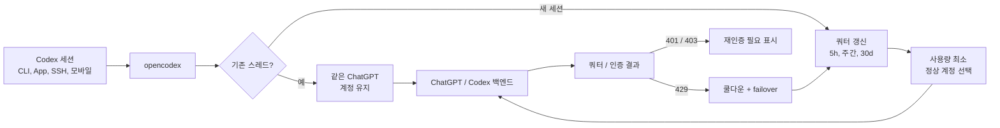

<h3 align="center">make codex open!</h3>
<p align="center"><code>npm install -g @bitkyc08/opencodex</code> · <code>ocx start</code> · <b>localhost:10100</b></p>

<p align="center">
  <a href="https://www.npmjs.com/package/@bitkyc08/opencodex"></a>
  <a href="https://github.com/lidge-jun/opencodex/blob/main/LICENSE"></a>
  
</p>

<p align="center">
  
</p>

<p align="center">
  <a href="README.md">English</a> · <b>한국어</b> · <a href="README.zh-CN.md">简体中文</a> · 📖 <a href="https://lidge-jun.github.io/opencodex/ko/"><b>전체 문서 →</b></a>
</p>

<p align="center">
  
</p>

Claude, Gemini, Grok, GLM, DeepSeek, Kimi, Qwen, Ollama 등 어떤 LLM이든 Codex에서 사용하세요 — OpenAI가 지원을 추가하기를 기다릴 필요 없이.

opencodex는 Codex의 Responses API를 프로바이더가 쓰는 프로토콜로 변환해 주는 가벼운 로컬 프록시입니다. streaming, tool 호출, reasoning 토큰, 이미지까지 양방향으로 모두 동작합니다.

또한 Codex 인증을 위한 **ChatGPT 계정 풀**을 관리할 수 있습니다. 여러 ChatGPT / Codex 계정을 추가하고,
대시보드에서 5시간 / 주간 / 30일 쿼터를 갱신하며, 새 세션을 사용량이 가장 적은 정상 계정으로 자동
라우팅할 수 있습니다. 기존 Codex 스레드는 시작한 계정에 그대로 고정되므로, 긴 SSH·tmux·모바일 연결
세션이 대화 도중 계정을 바꾸지 않습니다.

```
Codex CLI / App / SDK ──/v1/responses──▶ opencodex ──▶ Any provider
                                              │
              Anthropic · Google · xAI · Kimi · Ollama Cloud · Groq
              OpenRouter · Azure · DeepSeek · GLM · …and OpenAI itself
```



## 지원 플랫폼

| OS | 지원 상태 | 서비스 관리자 |
|---|---|---|
| macOS (arm64 / x64) | 완전 지원 | launchd |
| Linux (x64 / arm64) | 완전 지원 | systemd (user unit) |
| Windows (x64) | 완전 지원 | Task Scheduler |

[Node](https://nodejs.org) 18 이상이 필요합니다. Bun 런타임은 `npm install` 시 자동으로 번들되므로 따로 설치할 필요가 없습니다. 세 플랫폼 모두 네이티브로 동작합니다 (Windows에서도 WSL 없이 사용 가능합니다).

## 빠른 시작

```bash
# 설치 (Bun 런타임이 자동으로 번들됩니다 — Node 18+ 만 있으면 됩니다)
npm install -g @bitkyc08/opencodex

# 대화형 설정 (config 작성 + Codex 주입 + 자동 시작 shim 설치 선택)
ocx init

# 프록시 시작
ocx start

# init에서 건너뛰었다면 나중에 온디맨드 자동 시작 shim 설치
ocx codex-shim install

# Codex를 평소처럼 사용하세요 — opencodex를 통해 라우팅됩니다
codex "Write a hello world in Rust"
```

<details>
<summary><b>"bundled Bun runtime is missing" 오류가 나나요?</b></summary>

<br/>

opencodex는 Bun 런타임을 의존성으로 번들하고 Node 런처로 실행하므로 Bun을 직접 설치할 필요가 **없습니다**. "bundled Bun runtime is missing" 오류가 보이면 설치 과정에서 lifecycle 스크립트나 optional 의존성이 건너뛰어진 경우입니다. 해당 플래그 없이 다시 설치하세요:

```bash
npm install -g @bitkyc08/opencodex   # --ignore-scripts, --omit=optional 없이
```

</details>

## 프로바이더 추가하기

가장 쉬운 방법은 웹 대시보드를 이용하는 것입니다.

```bash
ocx gui
```

`http://localhost:10100` 대시보드가 열립니다. 여기서:

1. **"Add Provider"** 를 클릭하세요.
2. **40개 이상의 내장 프로바이더** 중에서 고르거나, 커스텀 OpenAI 호환 엔드포인트를 입력하세요.
3. API 키를 붙여넣으세요 (Anthropic, xAI, Kimi는 OAuth 로그인도 가능).
4. 프로바이더의 `/v1/models` 엔드포인트에서 모델이 **자동 감지**됩니다.

추가한 프로바이더는 재시작 없이 즉시 사용할 수 있습니다.

`ocx init`(대화형 CLI)이나 `~/.opencodex/config.json` 직접 편집으로도 프로바이더를 추가할 수 있습니다.

## 모델 라우팅

`provider/model` 형식으로 원하는 모델을 직접 지정할 수 있습니다:

```bash
# Anthropic을 통해 Claude Opus 사용
codex -m "anthropic/claude-opus-4-8" "이 스택 트레이스를 설명해 줘"

# Google을 통해 Gemini 사용
codex -m "google/gemini-3-pro" "auth.ts의 유닛 테스트를 작성해 줘"

# Ollama Cloud를 통해 GLM 사용
codex -m "ollama-cloud/glm-5.2" "SQL 마이그레이션을 작성해 줘"

# Ollama를 통해 로컬 모델 사용
codex -m "ollama/llama3" "이 함수를 리팩터링해 줘"
```

`provider/` 접두사를 생략하면 opencodex는 기본 프로바이더로 라우팅하거나, 모델명 패턴으로 자동
매칭합니다 (예: `claude-*`는 Anthropic, `gpt-*`는 OpenAI).

라우팅된 모델은 **Codex App** 모델 선택기에도 모델별 reasoning effort 컨트롤과 함께 나타납니다:

<p align="center">
  
</p>

## ChatGPT 계정 풀

대시보드의 **Codex Auth**를 열어 풀 계정을 추가하고, 다음 Codex 세션을 어느 계정이 처리할지 고르세요.
opencodex는 두 가지 동작을 분리해서 유지합니다:

- **기존 세션은 affinity를 유지합니다.** 스레드 id가 선택된 계정에 바인딩되어 이후 턴에서 재사용되므로,
  긴 요청이나 모바일/SSH 연결 세션이 같은 계정을 계속 사용합니다.
- **새 세션은 자동 라우팅됩니다.** 자동 전환이 켜져 있으면 opencodex는 5시간·주간·30일 사용량 중 가장
  뜨거운 쿼터 창을 비교해, 활성 계정이 임계치를 넘으면 새 세션을 사용량이 낮은 적격 계정으로 보냅니다.
- **쿼터 조회가 내장되어 있습니다.** 대시보드에서 모든 계정 쿼터를 한 번에 갱신할 수 있고, 요청 로그는
  풀 트래픽을 비-PII 계정 서수로 라벨링합니다.
- **실패는 fail-closed입니다.** 토큰 실패는 다른 자격증명으로 조용히 폴백하지 않고 재인증을 표시합니다.
  429 쿼터 응답은 계정을 쿨다운에 넣고 이후 작업을 다른 적격 풀 계정으로 failover할 수 있습니다.

## 주요 기능

- **어떤 LLM이든 Codex에서.** 5개의 프로토콜 adapter가 Anthropic Messages, Google Gemini, Azure, OpenAI Responses passthrough, 그리고 모든 OpenAI 호환 Chat Completions 엔드포인트를 커버합니다 — 즉 기본 제공 **40개 이상의 프로바이더**입니다.
- **ChatGPT 계정을 안전하게 풀링.** 기존 Codex 스레드는 한 계정에 유지하면서, 새 세션은 쿼터 갱신과 비-PII 요청 라벨과 함께 풀에서 사용량이 낮은 계정을 자동 선택할 수 있습니다.
- **한 번 로그인하면 API 키는 생략.** xAI, Anthropic, Kimi는 OAuth를 지원하므로 기존 계정으로 인증할 수 있고 토큰은 자동 갱신됩니다. 또는 `codex login`을 forward 하거나, API 키를 붙여넣거나, `${ENV_VAR}` 참조를 쓸 수 있습니다 — 선택은 자유입니다.
- **Codex가 동작하는 모든 곳에서.** Codex CLI, TUI, App, SDK에 자동으로 주입됩니다. 라우팅된 모델이 네이티브 모델처럼 Codex 모델 선택기에 나타납니다.
- **알맞은 모델에 위임.** 대시보드나 config에서 최대 5개의 라우팅/네이티브 모델을 Codex 서브에이전트 선택기에 노출해, 복잡한 작업은 reasoning 모델로, 빠른 작업은 저렴한 모델로 보낼 수 있습니다.
- **어떤 모델에도 초능력을.** OpenAI가 아닌 모델도 ChatGPT 로그인 위에서 도는 `gpt-5.4-mini` sidecar로 실제 웹 검색과 이미지 이해를 사용합니다.
- **무슨 일이 일어나는지 보이게.** 웹 대시보드가 프로바이더, OAuth 상태, 모델 선택, 실시간 요청 로그를 보여줍니다 — 왜 요청이 실패했는지 더는 추측하지 않아도 됩니다.
- **백그라운드 실행.** 시스템 서비스(launchd / systemd / Task Scheduler)로 설치하면 부팅 시 자동 시작되어 신경 쓸 필요가 없습니다.
- **깔끔한 종료, 잔여물 제로.** `ocx stop`(또는 대시보드의 Stop 버튼)은 프록시를 종료하고, 설치된 백그라운드 서비스를 멈추며, Codex를 원래 설정으로 복원합니다. 이후 `codex`는 잔여 설정이나 좀비 프로세스 없이 이전과 똑같이 동작합니다.

## 프로바이더 및 adapter

| Provider | Adapter | 인증 방식 |
|---|---|---|
| OpenAI (ChatGPT 로그인) | `openai-responses` | forward (키 불필요) |
| OpenAI (API 키) | `openai-responses` | key |
| Umans AI Coding Plan | `anthropic` | key |
| Anthropic Claude | `anthropic` | oauth / key |
| xAI Grok | `openai-chat` | oauth / key |
| Kimi (Moonshot) | `openai-chat` | oauth / key |
| Google Gemini | `google` | key |
| Azure OpenAI | `azure-openai` | key |
| Ollama Cloud + 17개 프로바이더 카탈로그 | `openai-chat` | key |
| Ollama / vLLM / LM Studio (로컬) | `openai-chat` | key (보통 비워둠) |
| 모든 OpenAI 호환 엔드포인트 | `openai-chat` | key |

그 외에 DeepSeek, Groq, OpenRouter, Together, Fireworks, Cerebras, Mistral, Hugging Face, NVIDIA NIM, MiniMax, Qwen Portal 등이 있습니다. 전체 목록은 `ocx init` 또는 [프로바이더 문서](https://lidge-jun.github.io/opencodex/ko/reference/configuration/)에서 확인하세요.

## CLI

```bash
ocx init                       # 대화형 설정
ocx start [--port 10100]       # 프록시 시작; 포트가 사용 중이면 빈 포트로 자동 전환
ocx stop                       # 프록시 중지 + Codex 원래 설정 복원
ocx restore                    # 중지 없이 복원 (별칭: ocx eject)
ocx uninstall                  # service/shim/config 제거 + Codex 원본 복원
ocx ensure                     # 필요 시 시작 + Codex config/cache 갱신
ocx sync                       # 모델 갱신 + Codex에 재주입
ocx status                     # 프록시 실행 중인지 확인
ocx login <xai|anthropic|kimi> # OAuth 로그인
ocx logout <provider>          # 저장된 로그인 정보 삭제
ocx gui                        # 웹 대시보드 열기
ocx codex-shim install         # codex 실행 시 `ocx ensure` 실행
ocx service <install|start|stop|status|uninstall>   # 백그라운드 서비스 (launchd/systemd/schtasks)
ocx update [--tag preview]     # opencodex 업데이트; preview 설치는 @preview 유지
```

### 자동 시작: service vs shim

opencodex에는 프록시를 자동 시작하는 두 가지 방법이 있습니다:

| | `ocx service install` | `ocx codex-shim install` |
|---|---|---|
| **방식** | OS 서비스 관리자 (launchd / systemd / schtasks) | `codex` 스크립트 런처를 래핑하며 실제 `codex.exe`는 건드리지 않음 |
| **시점** | 로그인 후 항상 실행 | 온디맨드 — `codex` 실행 시 `ocx ensure` 실행 |
| **재시작** | 크래시 시 자동 재시작 | `codex` 호출마다 한 번 시작 |
| **Codex 업데이트** | 영향 없음 | `ocx codex-shim install` 또는 `ocx update` 시 복구 |
| **제거** | `ocx service uninstall` | `ocx codex-shim uninstall` |

항상 프록시를 켜두려면 **service** (개발 머신 권장), 가볍게 온디맨드로 쓰려면 **shim**을 사용하세요.
shim 자동 시작은 기본으로 켜져 있으며 GUI 대시보드에서 끌 수 있습니다. 설정된 프록시 포트가 이미 사용
중이면 `ocx start`가 자동으로 다른 빈 로컬 포트를 고르고 Codex 설정도 그 포트로 갱신합니다.

### 삭제

npm 패키지를 지우기 전에 로컬 상태를 먼저 정리하세요:

```bash
ocx uninstall
npm uninstall -g @bitkyc08/opencodex
```

`ocx uninstall`은 프록시 중지, 설치된 service 제거, Codex shim 제거, Codex config/catalog/history
원복, `~/.opencodex` 삭제를 처리합니다.

## 설정

설정 파일은 `~/.opencodex/config.json`에 저장됩니다. 파일이 깨진 경우(잘못된 JSON 등)
opencodex는 `config.json.invalid-<timestamp>`로 백업하고 경고를 출력한 뒤 기본값으로 시작합니다.
원본 파일이 조용히 사라지는 일은 없습니다.

최소 설정 예시:

```json
{
  "port": 10100,
  "defaultProvider": "anthropic",
  "providers": {
    "anthropic": {
      "adapter": "anthropic",
      "baseUrl": "https://api.anthropic.com",
      "authMode": "oauth",
      "defaultModel": "claude-sonnet-4-6"
    },
    "ollama-cloud": {
      "adapter": "openai-chat",
      "baseUrl": "https://ollama.com/v1",
      "apiKey": "${OLLAMA_API_KEY}",
      "defaultModel": "glm-5.2"
    }
  }
}
```

프로바이더 항목은 라우팅 카탈로그 메타데이터도 함께 지정할 수 있습니다. `contextWindow`는 프로바이더
전체에 적용되는 Codex 노출용 컨텍스트 상한, `modelContextWindows`는 모델별 상한,
`modelInputModalities`는 `["text"]`나 `["text", "image"]` 같은 모델별 입력 힌트입니다. 이 값들은 라이브
`/models` 메타데이터를 상한으로 제한할 뿐, 더 작은 라이브 컨텍스트를 늘리지는 않습니다. 전체 필드는
설정 레퍼런스를 참고하세요.

> **Z.AI 경유 GLM-5.2 1M 컨텍스트:** `openai-chat` adapter에서는 `glm-5.2`와 `glm-5.2[1m]`이 모두
> 동작합니다 — opencodex가 요청 전에 끝의 `[1m]` 접미사를 제거하기 때문입니다(OpenAI 호환 엔드포인트는
> 대괄호 id를 거부함, Z.AI 400 code 1211). `[1m]` 접미사는 Claude-Code / Anthropic 엔드포인트 관례이며,
> 네이티브로 쓰려면 `anthropic` adapter를 Z.AI 코딩 base(`https://api.z.ai/api/coding/paas/v4`)로
> 향하게 하세요. 1M 컨텍스트 창은 모델명이 아니라 모델 카탈로그(`modelContextWindows`)로 설정합니다.

로컬 모델도 동작합니다. opencodex를 머신에서 실행 중인 OpenAI 호환 서버로 향하게 하세요:

```json
{
  "port": 10100,
  "defaultProvider": "ollama",
  "providers": {
    "ollama": {
      "adapter": "openai-chat",
      "baseUrl": "http://localhost:11434/v1",
      "authMode": "key",
      "apiKey": "",
      "defaultModel": "llama3"
    },
    "vllm": {
      "adapter": "openai-chat",
      "baseUrl": "http://localhost:8000/v1",
      "authMode": "key",
      "apiKey": "",
      "defaultModel": "Qwen/Qwen3-32B"
    }
  }
}
```

WebSocket 전송은 기본적으로 꺼져 있습니다. Codex가 HTTP/SSE 대신 Responses WebSocket 경로를 사용하게 하려면 `"websockets": true`를 설정하세요.

### 원격 접근

기본적으로 opencodex는 `127.0.0.1`(루프백)에 바인딩되며 별도 인증이 필요 없습니다.
`"hostname": "0.0.0.0"`으로 LAN에 노출할 경우, opencodex는 관리 API(`/api/*`)와 데이터 플레인(`/v1/responses`) 모두에 bearer 토큰을 요구합니다:

```bash
export OPENCODEX_API_AUTH_TOKEN="your-secret-token"
ocx start
```

비루프백 바인딩 시 이 환경 변수가 없으면 프록시 시작이 거부됩니다. LAN 접근용 백그라운드
서비스를 설치할 때도 같은 셸에서 이 변수를 먼저 설정한 뒤 `ocx service install`을 실행해야 합니다.
클라이언트(스크립트, 원격 머신)는 모든 요청에 토큰을 포함해야 합니다:

```
x-opencodex-api-key: your-secret-token
```

토큰은 타이밍 공격 방지를 위해 상수 시간으로 비교됩니다.

opencodex는 Codex resume 히스토리를 자동으로 remap해, 오래된 OpenAI 채팅과 opencodex가 만든 프로젝트
스레드가 프록시 활성 동안 Codex App에 계속 보이도록 합니다. 원본 provider/source 메타데이터는
`~/.opencodex/codex-history-backup.json`에 기록됩니다. `ocx stop` / `ocx restore`는 백업된 OpenAI 행을
OpenAI로 복원하고, 남은 opencodex 유저 스레드도 OpenAI로 eject 하여 네이티브 Codex가 `config.toml`에
더 이상 존재하지 않는 provider의 스레드를 resume 하려다 실패하지 않게 합니다.

백업 지원이 생기기 전의 옛 개발 빌드에서 `syncResumeHistory`가 이미 히스토리를 remap 했다면, 명시적
복구 명령을 실행할 수 있습니다:

```bash
ocx recover-history --legacy-openai
```

모든 필드에 대한 자세한 내용은 **[설정 레퍼런스](https://lidge-jun.github.io/opencodex/ko/reference/configuration/)** 를 참고하세요.

## 문서

공개 문서(설치, 프로바이더, 라우팅, sidecar, Codex 통합, Codex App 모델 선택기, CLI/설정 레퍼런스)는 [`docs-site/`](./docs-site)의 Astro 사이트로 빌드되어
**[lidge-jun.github.io/opencodex](https://lidge-jun.github.io/opencodex/ko/)** 에 게시됩니다.

유지보수용 source of truth는 [`structure/`](./structure)에, 과거 조사/진단 노트는 [`docs/`](./docs)에 있습니다.

## 개발

```bash
git clone https://github.com/lidge-jun/opencodex.git
cd opencodex
bun install
bun run dev:proxy    # dev 모드로 프록시 API 시작
bun run dev:gui      # 다른 터미널에서 대시보드 dev 서버 시작
bun x tsc --noEmit   # 타입 체크
```

`bun run dev`는 호환성을 위해 `bun run dev:proxy`의 별칭으로 남아 있습니다. 소스 체크아웃에서 프록시
API는 `/healthz`, `/v1/responses`, `/api/*`를 노출하며, `GET /`는 `bun run build:gui`가 `gui/dist`를
생성한 뒤에만 패키징된 대시보드를 서빙합니다. 대시보드를 수정할 때는 프론트엔드를 별도로 실행하세요:

```bash
bun run dev:gui
```

**[기여하기](https://lidge-jun.github.io/opencodex/ko/contributing/)** 를 참고하세요.

## 면책 조항

opencodex는 독립적인 커뮤니티 프로젝트이며, **OpenAI, Anthropic 등 어떤 제공업체와도 제휴하거나 보증을 받지 않습니다.**

일부 제공업체 — 특히 Anthropic (Claude) — 는 서드파티 프록시를 통한 API 트래픽 라우팅 시 계정을 정지하거나 제한할 수 있습니다. **사용에 따른 책임은 본인에게 있습니다 (UAYOR).** 제공업체를 연결하기 전에 해당 서비스 약관에서 프록시 기반 접근이 허용되는지 확인하세요. opencodex 유지보수자는 업스트림 제공업체의 계정 조치에 대해 책임을 지지 않습니다.

## 라이선스

MIT
