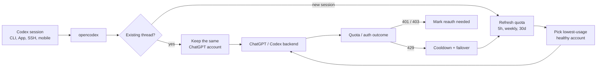

<h3 align="center">make codex open!</h3>
<p align="center"><code>npm install -g @bitkyc08/opencodex</code> · <code>ocx start</code> · <b>localhost:10100</b></p>

<p align="center">
  <a href="https://www.npmjs.com/package/@bitkyc08/opencodex"></a>
  <a href="https://github.com/lidge-jun/opencodex/blob/main/LICENSE"></a>
  
</p>

<p align="center">
  
</p>

<p align="center">
  <a href="README.md">English</a> · <a href="README.ko.md">한국어</a> · <a href="README.zh-CN.md">简体中文</a> · 📖 <a href="https://lidge-jun.github.io/opencodex/"><b>Full documentation →</b></a>
</p>

<p align="center">
  
</p>

Use Claude, Gemini, Grok, GLM, DeepSeek, Kimi, Qwen, Ollama, or any other LLM with Codex — without waiting for OpenAI to add support.

opencodex is a lightweight local proxy that translates Codex's Responses API into whatever your provider speaks. Streaming, tool calls, reasoning tokens, images — everything works, in both directions.

It can also manage a **ChatGPT account pool** for Codex auth. Add multiple ChatGPT / Codex accounts,
refresh their 5h / weekly / 30d quota in the dashboard, and let new sessions auto-route to the
lowest-usage healthy account. Existing Codex threads stay pinned to the account that started them,
so long SSH, tmux, or mobile-connected sessions do not jump accounts mid-conversation.

```
Codex CLI / App / SDK ──/v1/responses──▶ opencodex ──▶ Any provider
                                              │
              Anthropic · Google · xAI · Kimi · Ollama Cloud · Groq
              OpenRouter · Azure · DeepSeek · GLM · …and OpenAI itself
```



## Supported platforms

| OS | Status | Service manager |
|---|---|---|
| macOS (arm64 / x64) | Fully supported | launchd |
| Linux (x64 / arm64) | Fully supported | systemd (user unit) |
| Windows (x64) | Fully supported | Task Scheduler |

Requires [Node](https://nodejs.org) 18+. The Bun runtime is bundled automatically on `npm install` — no separate Bun install needed. All three platforms work natively (no WSL needed on Windows).

## Quick start

```bash
# Install (bundles the Bun runtime automatically — only Node 18+ required)
npm install -g @bitkyc08/opencodex

# Interactive setup (writes config, injects into Codex, and offers autostart shim install)
ocx init

# Start the proxy
ocx start

# If you skipped it during init, install the on-demand autostart shim later
ocx codex-shim install

# Use Codex normally — it now routes through opencodex
codex "Write a hello world in Rust"
```

<details>
<summary><b>"bundled Bun runtime is missing" error?</b></summary>

<br/>

opencodex bundles the Bun runtime as a dependency and runs it via a Node
launcher, so you do **not** need to install Bun yourself. If you see a
"bundled Bun runtime is missing" error, the install skipped lifecycle scripts
or optional dependencies. Reinstall without those flags:

```bash
npm install -g @bitkyc08/opencodex   # no --ignore-scripts, no --omit=optional
```

</details>

## Add a provider

The fastest way to add a provider is through the web dashboard:

```bash
ocx gui
```

This opens the dashboard at `http://localhost:10100`. From there:

1. Click **"Add Provider"**
2. Pick from **40+ built-in providers** — or enter a custom OpenAI-compatible endpoint
3. Paste your API key (or log in via OAuth for Anthropic, xAI, and Kimi)
4. Models are **auto-discovered** from the provider's `/v1/models` endpoint

Your new provider is ready to use immediately. No restart needed.

You can also add providers through `ocx init` (interactive CLI) or by editing `~/.opencodex/config.json` directly.

## Model routing

Target any configured provider and model using the `provider/model` syntax:

```bash
# Use Claude Opus through Anthropic
codex -m "anthropic/claude-opus-4-8" "Explain this stack trace"

# Use Gemini through Google
codex -m "google/gemini-3-pro" "Write unit tests for auth.ts"

# Use GLM through Ollama Cloud
codex -m "ollama-cloud/glm-5.2" "Write a SQL migration"

# Use a local model through Ollama
codex -m "ollama/llama3" "Refactor this function"
```

When you omit the `provider/` prefix, opencodex routes to the default provider — or auto-matches based on the model name pattern (e.g., `claude-*` routes to Anthropic, `gpt-*` routes to OpenAI).

Routed models also appear in the **Codex App** model picker with per-model reasoning effort controls:

<p align="center">
  
</p>

## ChatGPT account pool

Open **Codex Auth** in the dashboard to add pool accounts and choose which account should handle the
next Codex session. opencodex keeps two separate behaviors:

- **Existing sessions keep affinity.** A thread id is bound to the selected account and reused on
  later turns, so a long request or a mobile/SSH-attached session keeps using the same account.
- **New sessions can auto-route.** When auto-switch is enabled, opencodex compares the hottest known
  quota window across 5h, weekly, and 30d usage, then picks a lower-usage eligible account for new
  sessions once the active account crosses the threshold.
- **Quota lookup is built in.** The dashboard can refresh all account quotas in one click, and the
  request log labels pool traffic with non-PII account ordinals.
- **Failures fail closed.** Token failures mark reauthentication instead of falling back to another
  credential silently; 429 quota responses put the account in cooldown and can fail over future work
  to another eligible pool account.

## Highlights

- **Use any LLM with Codex.** 5 protocol adapters cover Anthropic Messages, Google Gemini, Azure, OpenAI Responses passthrough, and every OpenAI-compatible Chat Completions endpoint — that's 40+ providers out of the box.
- **Pool ChatGPT accounts safely.** Keep existing Codex threads on one account while new sessions
  can auto-pick a lower-usage account from the pool, with quota refresh and non-PII request labels.
- **Log in once, skip the API key.** OAuth support for xAI, Anthropic, and Kimi means you can authenticate with your existing account. Tokens auto-refresh. Or forward your `codex login`, paste an API key, or use `${ENV_VAR}` references — your call.
- **Works everywhere Codex does.** Injects into Codex CLI, TUI, App, and SDK automatically. Routed models show up in Codex's model picker just like native ones.
- **Delegate to the right model.** Feature up to five routed or native models in Codex's subagent picker from the dashboard or config — route complex tasks to a reasoning model, fast tasks to a cheap one.
- **Give any model superpowers.** Non-OpenAI models get real web search and image understanding via a `gpt-5.4-mini` sidecar over your ChatGPT login.
- **See what's happening.** The web dashboard shows providers, OAuth status, model selection, and a live request log — no more guessing why a request failed.
- **Runs in the background.** Install as a system service (launchd / systemd / Task Scheduler) and forget about it. The proxy starts on boot and stays out of your way.
- **Clean exit, zero residue.** `ocx stop` (or the dashboard's Stop button) shuts down the proxy, stops the background service if one is installed, and restores Codex to its original configuration. Plain `codex` works exactly as it did before — no leftover config, no orphaned processes.

## Providers & adapters

| Provider | Adapter | Auth |
|---|---|---|
| OpenAI (ChatGPT login) | `openai-responses` | forward (no key) |
| OpenAI (API key) | `openai-responses` | key |
| Umans AI Coding Plan | `anthropic` | key |
| Anthropic Claude | `anthropic` | oauth / key |
| xAI Grok | `openai-chat` | oauth / key |
| Kimi (Moonshot) | `openai-chat` | oauth / key |
| Google Gemini | `google` | key |
| Azure OpenAI | `azure-openai` | key |
| Ollama Cloud + 17-provider catalog | `openai-chat` | key |
| Ollama / vLLM / LM Studio (local) | `openai-chat` | key (usually blank) |
| Any OpenAI-compatible endpoint | `openai-chat` | key |

Plus DeepSeek, Groq, OpenRouter, Together, Fireworks, Cerebras, Mistral, Hugging Face, NVIDIA NIM, MiniMax, Qwen Portal, and more. See the full list with `ocx init` or in the [provider docs](https://lidge-jun.github.io/opencodex/reference/configuration/).

## CLI

```bash
ocx init                       # interactive setup
ocx start [--port 10100]       # start the proxy; falls back to a free port if busy
ocx stop                       # stop + restore native Codex
ocx restore                    # restore without stopping (alias: ocx eject)
ocx uninstall                  # remove service/shim/config and restore native Codex
ocx ensure                     # start if needed + refresh Codex config/cache
ocx sync                       # refresh models + re-inject into Codex
ocx codex-shim install         # run `ocx ensure` whenever `codex` is launched
ocx status                     # is the proxy running?
ocx login <xai|anthropic|kimi> # OAuth login
ocx logout <provider>          # remove a stored login
ocx gui                        # open the web dashboard
ocx service <install|start|stop|status|uninstall>   # background service (launchd/systemd/schtasks)
ocx update [--tag preview]     # update opencodex; preview installs stay on @preview
```

### Autostart: service vs shim

opencodex has two ways to auto-start the proxy:

| | `ocx service install` | `ocx codex-shim install` |
|---|---|---|
| **How** | OS service manager (launchd / systemd / schtasks) | Wraps script launchers for `codex`; real `codex.exe` is left untouched |
| **When** | Always running after login | On-demand — runs `ocx ensure` when `codex` is launched |
| **Restart** | Auto-restarts on crash | Starts once per `codex` invocation |
| **Codex updates** | Unaffected | Repairs on next `ocx codex-shim install` or `ocx update` |
| **Remove** | `ocx service uninstall` | `ocx codex-shim uninstall` |

Use the **service** for always-on proxy (recommended for development machines). Use the **shim** for
lightweight, on-demand proxy startup without a background daemon. Shim autostart is enabled by default
and can be disabled from the GUI dashboard. If the configured proxy port is already busy, `ocx start`
automatically picks another free local port and updates Codex to use it.

### Uninstall

Before removing the npm package, clean up local state:

```bash
ocx uninstall
npm uninstall -g @bitkyc08/opencodex
```

`ocx uninstall` stops the proxy, removes any installed service, removes the Codex shim, restores
native Codex config/catalog/history, and deletes `~/.opencodex`.

## Configuration

Config lives at `~/.opencodex/config.json`. If the file cannot be parsed (e.g. truncated or
manually broken JSON), opencodex backs it up to `config.json.invalid-<timestamp>`, prints a warning,
and falls back to defaults — so your original file is never silently lost.

Here's a typical multi-provider setup:

```json
{
  "port": 10100,
  "defaultProvider": "anthropic",
  "providers": {
    "anthropic": {
      "adapter": "anthropic",
      "baseUrl": "https://api.anthropic.com",
      "authMode": "oauth",
      "defaultModel": "claude-sonnet-4-6"
    },
    "ollama-cloud": {
      "adapter": "openai-chat",
      "baseUrl": "https://ollama.com/v1",
      "apiKey": "${OLLAMA_API_KEY}",
      "defaultModel": "glm-5.2"
    }
  }
}
```

Provider entries can also annotate routed catalog metadata. Use `contextWindow` for a provider-wide
Codex-visible context cap, `modelContextWindows` for model-specific caps, and
`modelInputModalities` for model-specific catalog input hints such as `["text"]` or
`["text", "image"]`. Context values cap live `/models` metadata; they never raise a smaller live
context window. See the configuration reference for the full field list.

> **GLM-5.2 1M context via Z.AI:** through the `openai-chat` adapter, both `glm-5.2`
> and `glm-5.2[1m]` work — opencodex strips the trailing `[1m]` suffix before
> sending the request, since OpenAI-compatible endpoints reject the bracketed id
> (Z.AI 400 code 1211). The `[1m]` suffix is a Claude-Code / Anthropic-endpoint
> convention; to use it natively, point the `anthropic` adapter at Z.AI's coding
> base (`https://api.z.ai/api/coding/paas/v4`). Set the 1M context window via the
> model catalog (`modelContextWindows`), not the model name.

Local models work too. Point opencodex at any OpenAI-compatible server running on your machine:

```json
{
  "port": 10100,
  "defaultProvider": "ollama",
  "providers": {
    "ollama": {
      "adapter": "openai-chat",
      "baseUrl": "http://localhost:11434/v1",
      "authMode": "key",
      "apiKey": "",
      "defaultModel": "llama3"
    },
    "vllm": {
      "adapter": "openai-chat",
      "baseUrl": "http://localhost:8000/v1",
      "authMode": "key",
      "apiKey": "",
      "defaultModel": "Qwen/Qwen3-32B"
    }
  }
}
```

WebSocket transport is off by default. Set `"websockets": true` only if you want Codex to advertise and use the Responses WebSocket path instead of HTTP/SSE.

### Remote access

By default opencodex binds to `127.0.0.1` (loopback) and requires no extra authentication.
If you set `"hostname": "0.0.0.0"` to expose the proxy on the LAN, opencodex requires a bearer token
to protect both the management API (`/api/*`) and the data-plane (`/v1/responses`):

```bash
export OPENCODEX_API_AUTH_TOKEN="your-secret-token"
ocx start
```

The proxy refuses to start without this variable when binding beyond loopback. If you install a
background service for LAN access, export the same variable before `ocx service install` so the
service manager receives it.
Clients (scripts, remote machines) must include the token in every request:

```
x-opencodex-api-key: your-secret-token
```

The token is compared in constant time to prevent timing attacks.

opencodex automatically remaps Codex resume history so old OpenAI chats and opencodex-created project
threads stay visible in Codex App while the proxy is active. opencodex records the original provider/source metadata in
`~/.opencodex/codex-history-backup.json`. `ocx stop` / `ocx restore` restores backed-up OpenAI rows
to OpenAI, and ejects any remaining opencodex user threads to OpenAI as well so native Codex does not
try to resume a thread whose provider no longer exists in `config.toml`.

If you tested an older development build where `syncResumeHistory` already remapped history before
backup support existed, you can also run the explicit recovery command:

```bash
ocx recover-history --legacy-openai
```

See the **[Configuration reference](https://lidge-jun.github.io/opencodex/reference/configuration/)** for every field.

## Documentation

The public docs — install, providers, routing, sidecars, Codex integration, Codex App model picker, and CLI/config reference — are built from [`docs-site/`](./docs-site) and published to **[lidge-jun.github.io/opencodex](https://lidge-jun.github.io/opencodex/)**.

Maintainer source-of-truth notes live under [`structure/`](./structure). Historical investigations remain under [`docs/`](./docs).

## Development

```bash
git clone https://github.com/lidge-jun/opencodex.git
cd opencodex
bun install
bun run dev:proxy    # start the proxy API in dev mode
bun run dev:gui      # start the dashboard dev server in another terminal
bun x tsc --noEmit   # typecheck
```

`bun run dev` remains an alias for `bun run dev:proxy` for compatibility. In a source checkout,
the proxy API exposes `/healthz`, `/v1/responses`, and `/api/*`; `GET /` serves the packaged
dashboard only after `bun run build:gui` has produced `gui/dist`. While hacking on the dashboard,
run the frontend separately:

```bash
bun run dev:gui
```

See **[Contributing](https://lidge-jun.github.io/opencodex/contributing/)**.

## Disclaimer

opencodex is an independent, community-maintained project and is **not affiliated with or endorsed by OpenAI, Anthropic, or any other provider**.

Some providers — notably Anthropic (Claude) — may suspend or restrict accounts that route API traffic through third-party proxies. **Use at your own risk (UAYOR).** Before connecting a provider, review its Terms of Service to confirm that proxy-based access is permitted. The opencodex maintainers are not responsible for any account actions taken by upstream providers.

## License

MIT
